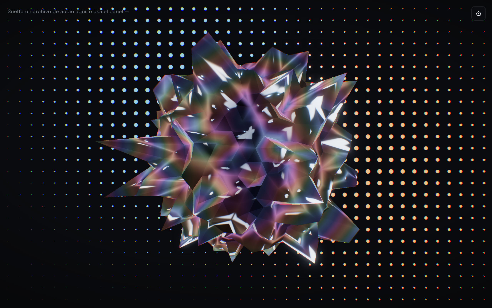
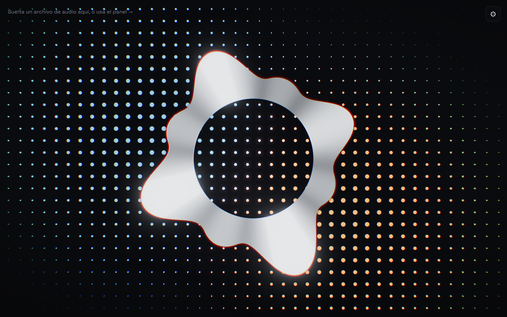

# Nikkiro Audio Visualizer — 3D Liquid Chrome Music Visualizer

**Nikkiro Audio Visualizer** is a free, open-source **3D audio-reactive music visualizer** for the web and Windows desktop, built with [Three.js](https://threejs.org/) and [WebGL](https://www.khronos.org/webgl/). A liquid-chrome object — switchable between a spiky ferrofluid-style **sphere** and a fluid neon **ring** — deforms, glows, and pulses in real time to any audio source: a music file, your microphone, or your computer's system audio. Run it in the browser, or install it as a lightweight always-on-top **desktop widget** for Windows (Electron) that behaves like a live audio spectrum visualizer sitting on top of your other windows.

[](https://github.com/koyboiii-coder/Nikkiro-Audio-Visualizer/releases/latest)
[](https://github.com/koyboiii-coder/Nikkiro-Audio-Visualizer/releases/latest)
[](https://github.com/koyboiii-coder/Nikkiro-Audio-Visualizer/releases/latest)
[](https://threejs.org/)
[](https://www.electronjs.org/)

**[⬇️ Download the latest Windows release](https://github.com/koyboiii-coder/Nikkiro-Audio-Visualizer/releases/latest)** — a single portable `.exe`, no installation required.

<p>
  
  
</p>

## Contents

- [Features](#features)
- [Tech stack](#tech-stack)
- [Download / Getting started](#download--getting-started)
- [Running as a Windows desktop widget](#running-as-a-windows-desktop-widget-electron)
- [Controls](#controls)
- [Project structure](#project-structure)

## Features

Nikkiro Audio Visualizer isn't just one shape or one look — it's a small toolkit of audio-reactive 3D materials and forms:

- **Two reactive shapes**: a spiky, ferrofluid-inspired **sphere** with real Worley-noise displacement, or a flat, camera-facing **liquid ring** whose outer edge bulges like a circular equalizer — one lobe per frequency band, low tones and high tones lighting up different zones instead of the whole shape jumping together.
- **Two materials for the sphere**: glossy **black liquid metal** (physically-based `MeshPhysicalMaterial` with a custom studio environment map) or a **transparent glass** mode that lets your desktop or the animated background show straight through it.
- **"Liquid Chrome" iridescent sheen**: a prismatic, chromatic-aberration rim light that shifts through hues as the audio hits, plus a multi-layer fading **trail/echo effect** on both shapes — colorable from the panel via an "Iris" tint.
- **Per-band frequency equalizer**: audio is split into 8 log-spaced frequency bands (not just bass/mid/treble), mapped around the shape so bass, mids, and treble each visibly animate their own region.
- **Three audio input sources**: local audio file (drag-and-drop or file picker), microphone, or **system audio capture** (grabs whatever is playing on your PC, with zero dialogs in the desktop app).
- **Reactive rotation with real inertia**: bass hits add angular acceleration to the spin instead of snapping to the current audio level, so it feels driven by momentum rather than mechanically tracking the signal.
- **Two background styles**: an animated halftone dot-grid or a soft blurred aura — both react to bass with the same underlying reactive uniforms.
- **19 curated color presets** plus full manual control over 5 color fields (valley, peak, accent, background, iris), each preset keeping its hues analogous so the material always reads as one coherent metal or glass.
- **Desktop widget mode (Windows/Electron)**: a frameless, always-on-top window with a system tray icon, automatic system-audio capture with no picker dialog, and an optional **frosted/acrylic glass window** that lets your desktop show through, blurred, behind the whole app.

## Tech stack

- [Three.js](https://threejs.org/) — custom `onBeforeCompile` GLSL shader injection on `MeshPhysicalMaterial`, `EffectComposer` + `UnrealBloomPass` + custom chromatic-aberration pass, `PMREMGenerator` for environment maps
- [Vite](https://vitejs.dev/) — dev server and production build
- [Electron](https://www.electronjs.org/) + [electron-builder](https://www.electron.build/) — optional Windows desktop-widget build (portable `.exe`)
- Web Audio API (`AnalyserNode`) — real-time frequency analysis, both a 3-band (bass/mid/treble) split and an 8-band log-spaced spectrum
- Plain CSS (no framework) — UI, animated background, frosted-glass panel

## Download / Getting started

**Just want to run it?** Grab the latest Windows portable `.exe` from the [Releases page](https://github.com/koyboiii-coder/Nikkiro-Audio-Visualizer/releases/latest) — no install, no dependencies, just double-click.

**Running from source** (any OS, in the browser):

```bash
npm install
npm run dev
```

Open the URL Vite prints (usually `http://localhost:5173`).

## Running as a Windows desktop widget (Electron)

```bash
npm run electron:dev
```

This starts the Vite dev server and opens the app in a frameless, always-on-top Electron
window. Closing it (the `×` in its title bar) minimizes it to the system tray instead of
quitting — right-click the tray icon for "Salir" to actually exit.

To build a standalone portable `.exe` (Windows):

```bash
npm run icons   # regenerate electron/icon.png + icon.ico if you've changed the icon
npm run dist    # vite build + electron-builder
```

The output lands in `release/`. Note: on Windows, electron-builder needs the
**"create symbolic links"** privilege to package the portable executable — enable
**Developer Mode** (Settings → Privacy & security → For developers) if the build fails
with a symlink-permission error.

## Controls

| Section | What it does |
|---|---|
| Fuente de audio | Choose file / microphone / system audio (and toggle a source off by clicking it again) |
| Forma | Switch between the Esfera (sphere) and Aro (ring) shapes |
| Material (esfera) | Sphere-only: Metal (opaque liquid metal) or Cristal (transparent glass) |
| Fondo | Puntos (halftone dot grid) or Difuminado (blurred aura) background style |
| Ventana | Electron only: toggle the frosted/acrylic glass window effect |
| Paletas | 19 preset color combinations |
| Colores | Valle (valley), Pico (peak), Acento (accent light), Fondo (background), Iris (iridescent rim tint) |
| Sensibilidad | Overall audio reactivity multiplier |
| Suavizado | How quickly the visuals respond to changes in the audio signal |
| Densidad de picos | Number/size of the sphere's spikes |
| Nitidez | How pointed the sphere's spikes are (the ring stays rounded regardless) |
| Rotación | Base rotation speed multiplier (sphere only) |
| Brillo (bloom) | Post-processing glow intensity |
| Pulso del fondo | Ceiling for how much bass speeds up the background flow |

## Project structure

```
index.html                   entry HTML — canvas, panel markup, Electron title bar
src/main.js                  scene setup, UI wiring, animation loop, presets
src/shaders.js                sphere spike displacement + ring/background GLSL (Worley noise,
                               circular equalizer, liquid-chrome sheen, trail/echo layers)
src/audio.js                  Web Audio analyser (file / mic / system capture, 3-band + 8-band spectrum)
src/style.css                 app-specific styles (panel layout, title bar, etc.)
src/styles/liquid-chrome.css  the "Liquid Chrome" background/UI design system
electron/main.cjs             Electron main process (window, tray, glass mode, system-audio handler)
electron/preload.cjs          contextBridge API exposed to the renderer
electron/generate-icons.cjs   generates the app icon (pure Node, no dependencies)
```
