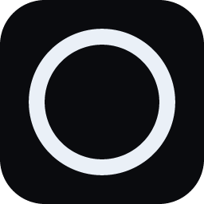

# Nikkiro Audio Visualizer

A 3D audio-reactive music visualizer built with [Three.js](https://threejs.org/): a metallic,
spiky blob — modeled after real ferrofluid under a magnetic field — that deforms and reacts
live to whatever audio is playing, with a fully configurable color system and an optional
desktop-widget mode (Electron) that floats always-on-top with a system tray icon.



## What it does

- **Spiky ferrofluid deformation**: the object's surface uses a custom GLSL vertex shader
  built on jittered 3D Worley (cellular) noise — not smooth Perlin/simplex noise — so it forms
  actual pointed cones like a real ferrofluid under a magnet, instead of soft rounded bumps.
  Bass drives spike height, treble drives fine surface detail. In silence the surface stays
  essentially flat and static; it only "wakes up" when audio hits it, with fast attack and
  fast decay (no lingering or idle drifting).
- **Glossy black liquid-metal shading**: a physically-based (`MeshPhysicalMaterial`) metal
  with a custom studio-style environment map (a mostly-dark room with a few bright "softbox"
  panels) — that contrast is what makes it read as deep black with sharp white highlights,
  the same way real ferrofluid product photography is lit.
- **Audio input, three ways**:
  - Upload an audio file (drag-and-drop or file picker)
  - Microphone
  - **System audio capture** — grabs whatever is playing on your PC via screen/tab sharing
    (or automatically, with no dialog, when running as the Electron desktop app)
- **Reactive rotation with real inertia**: bass hits add angular *acceleration* to the spin
  instead of just snapping the speed to the current audio level, so it feels like the music is
  spinning it up, with momentum, rather than mechanically tracking the signal.
- **"Liquid Chrome" visual system**: an animated, slowly-drifting chrome/oil-slick background
  (pure CSS, rendered behind a transparent WebGL canvas) with a frosted-glass control panel,
  Cinzel/Space Grotesk/Space Mono typography, and a single solid accent color. The background's
  flow speed and iridescence intensity react to bass too.
- **13 curated color presets** (plus full manual control over 4 color fields: valley, peak,
  accent, and background), each keeping its hues analogous so the metal always reads as one
  coherent material.
- **Desktop widget mode (Electron)**: a frameless, always-on-top window with a system tray
  icon ("show", "always on top", "start with Windows", "quit"), its own custom title bar, and
  automatic system-audio capture with no picker dialog.

## Tech stack

- [Three.js](https://threejs.org/) (custom `onBeforeCompile` shader injection on
  `MeshPhysicalMaterial`, `EffectComposer` + `UnrealBloomPass`, `PMREMGenerator` for the
  environment maps)
- [Vite](https://vitejs.dev/) for the dev server and build
- [Electron](https://www.electronjs.org/) + [electron-builder](https://www.electron.build/)
  for the optional desktop-widget build
- Web Audio API (`AnalyserNode`) for frequency analysis (bass / mid / treble bands)
- Plain CSS (no framework) for the UI and the animated background

## Getting started

```bash
npm install
npm run dev
```

Open the URL Vite prints (usually `http://localhost:5173`).

## Running as a desktop widget (Electron)

```bash
npm run electron:dev
```

This starts the Vite dev server and opens the app in a frameless, always-on-top Electron
window. Closing it (the `×` in its title bar) minimizes it to the system tray instead of
quitting — right-click the tray icon for "Salir" to actually exit.

To build a standalone portable `.exe` (Windows):

```bash
npm run icons   # regenerate electron/icon.png + icon.ico if you've changed the icon
npm run dist    # vite build + electron-builder
```

The output lands in `release/`. Note: on Windows, electron-builder needs the
**"create symbolic links"** privilege to package the portable executable — enable
**Developer Mode** (Settings → Privacy & security → For developers) if the build fails
with a symlink-permission error.

## Project structure

```
index.html                   entry HTML — canvas, panel markup, Electron title bar
src/main.js                  scene setup, UI wiring, animation loop, presets
src/shaders.js                the Worley-noise spike displacement GLSL
src/audio.js                  Web Audio analyser (file / mic / system capture)
src/style.css                 app-specific styles (panel layout, title bar, etc.)
src/styles/liquid-chrome.css  the "Liquid Chrome" background/UI design system
electron/main.cjs             Electron main process (window, tray, system-audio handler)
electron/preload.cjs          contextBridge API exposed to the renderer
electron/generate-icons.cjs   generates the app icon (pure Node, no dependencies)
```

## Controls

| Section | What it does |
|---|---|
| Fuente de audio | Choose file / microphone / system audio |
| Paletas | 13 preset color combinations |
| Colores | Valle (valley), Pico (peak), Acento (accent light), Fondo (background) |
| Sensibilidad | Overall audio reactivity multiplier |
| Suavizado | How quickly the visuals respond to changes in the audio signal |
| Densidad de picos | Number/size of spikes |
| Nitidez | How pointed the spikes are |
| Rotación | Base rotation speed multiplier |
| Brillo (bloom) | Post-processing glow intensity |
| Fluidez del fondo | Ceiling for how much bass speeds up the background flow |
